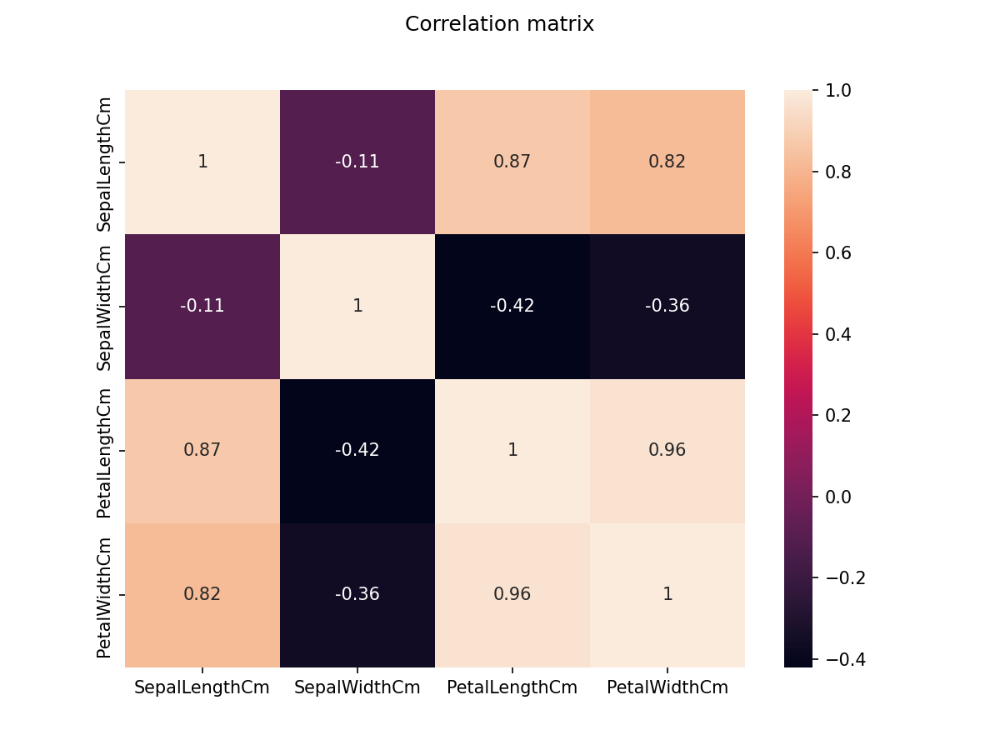
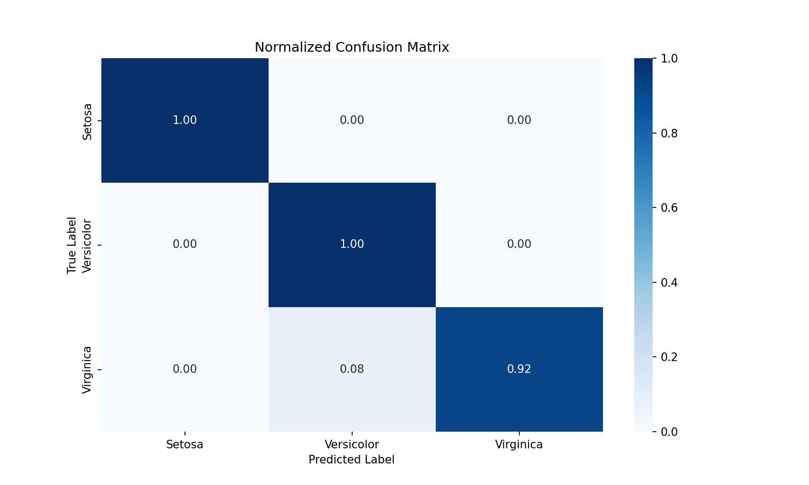
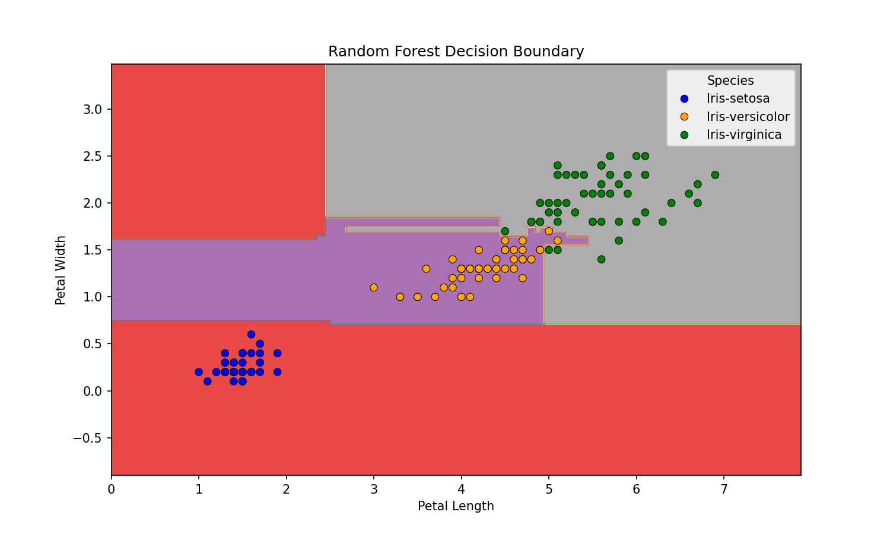
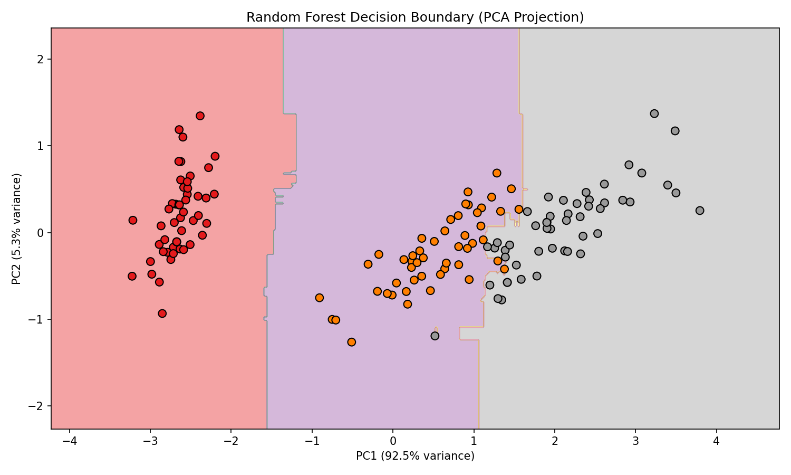

# Iris Flower Classification

A machine learning project that classifies iris flowers into three species based on their physical measurements.

It demonstrates an end-to-end machine learning workflow, including data exploration, model training, evaluation, and visualization, with an optional interactive Streamlit application for real-time predictions.

This project is designed as both a learning resource and a portfolio project, showcasing practical machine learning skills from data analysis to model deployment.


## Dataset

The Iris dataset contains 150 samples with the following features:

- Sepal Length (cm)
- Sepal Width (cm)
- Petal Length (cm)
- Petal Width (cm)
- Species (target label)

### Classes
- Iris-setosa  
- Iris-versicolor  
- Iris-virginica  


The dataset was provided as part of a supervised academic assignment and is based on the classic Iris dataset commonly used in machine learning education.


## Objective

The goal of this project is to predict the species of an iris flower based on its physical measurements using machine learning, and evaluate model performance using standard classification metrics.


## Model

A **Random Forest Classifier** is used for training and prediction.

### Why Random Forest:
- High accuracy on structured datasets
- Handles non-linear relationships well
- Robust and stable performance
- Minimal preprocessing required

### Performance Metrics (Evaluated on test split (30%)):
- Accuracy: 97.78%
- Precision: 98.04%
- Recall: 97.44%
- F1-Score: 97.66%


## Features

### Machine Learning
- Model training and evaluation (Random Forest)
- Confusion matrix analysis
- Feature importance visualization

### Data Visualization
- Data exploration (EDA)
- 2D and 3D plots
- PCA visualization
- Correlation matrix

### Application (Streamlit)
- Interactive prediction system
- User input interface for real-time predictions

### Reporting
- PDF report generation


## Tech Stack

- Python
- Pandas
- NumPy
- Scikit-learn
- Matplotlib
- Seaborn
- Plotly
- Streamlit
- Joblib


## Project Structure

```
iris_classification/
│
├── app/
│   │   app.py
│   │   iris_model.pkl
│   │   utils.py
│
├── data/
│   │   iris_dataset.csv
│
├── img/
│   │   Iris_setosa.jpg
│   │   Iris_versicolor.jpg
│   │   Iris_virginica.jpg
│   │
│   └── output/
│           class_dist.png
│           conf_matrix.png
│           corr_matrix.png
│           data_viz.png
│           desc_bound.png
│           eda.png
│           pca.png
│           violin_plot.png
│
├── notebooks/
│       iris_classification.ipynb
│
├── src/
│       iris_classification.py
│
│
│   .gitignore
│   README.md
│   requirements.txt
```


## Installation

- Python 3.10+

### 1. Clone the repository

```bash
git clone https://github.com/thecrack243/iris-classification.git
cd iris_classification
```

### 2. (Optional) Create a virtual environment

```bash
# Windows
python -m venv venv
venv\Scripts\activate

# Mac / Linux
python3 -m venv venv
source venv/bin/activate
```

### 3. Install dependencies

```bash
pip install -r requirements.txt
```


## How to Run

### Train the model (optional)

```bash
cd src
python iris_classification.py
```

### Run the Streamlit app

```bash
cd app
streamlit run app.py
```

App will open at: http://localhost:8501


## Results

The model achieves strong performance on the dataset:

- Accuracy: 97.78%
- Excellent class separation
- Petal features are the most important predictors


## Key Insights

- Petal length and petal width are the most important features
- The dataset is highly separable
- Random Forest performs very well without heavy tuning

<p align="center">
  
  
</p>

<p align="center">
  
  
</p>


## Future Improvements

- [ ] Implement SVM model and compare performance with Random Forest
- [ ] Implement KNN classifier and evaluate accuracy
- [ ] Add model comparison table (Accuracy, Precision, Recall, F1-score)
- [ ] Apply hyperparameter tuning
- [ ] Improved PDF report layout
- [ ] Enhance Streamlit UI (layout, spacing, user inputs)


## Contributing

Contributions are welcome!

You can contribute by:

- Adding new machine learning models (SVM, KNN, etc.)
- Improving visualizations
- Enhancing the Streamlit UI
- Fixing bugs
- Improving documentation

Steps:

- Fork the repository
- Create a new branch (feature/your-feature)
- Commit your changes
- Push to your fork
- Open a Pull Request


## Author

Emmanuel Ilunga  
Machine Learning Project — 2026  


## Live Demo
https://iris-classification-rf.streamlit.app

## License

This project is licensed under the MIT License. See LICENSE file for details.